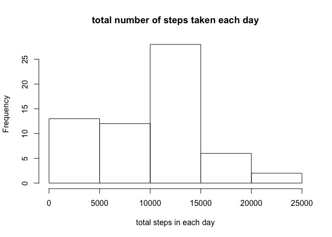
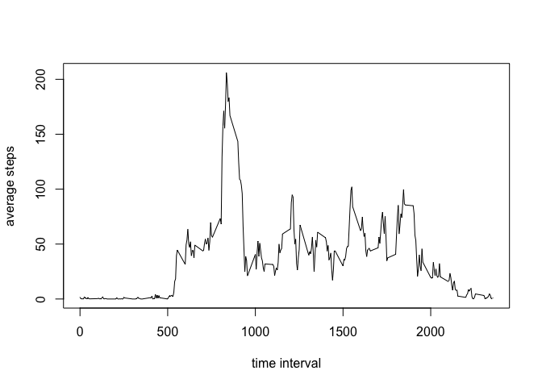
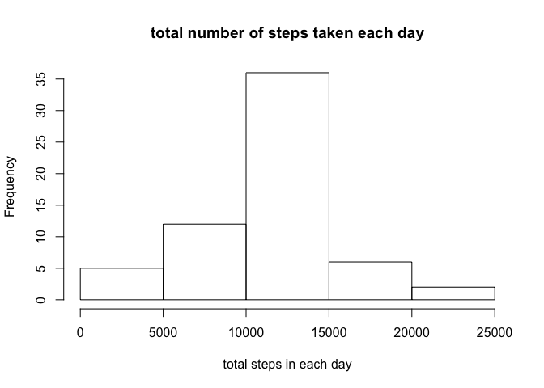
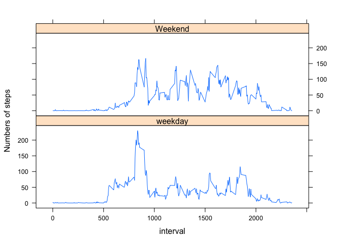

# Reproducible Research: Peer Assessment 1


## Loading and preprocessing the data


```r
library(dplyr)
```

```
## 
## Attaching package: 'dplyr'
## 
## The following objects are masked from 'package:stats':
## 
##     filter, lag
## 
## The following objects are masked from 'package:base':
## 
##     intersect, setdiff, setequal, union
```

```r
dat<-read.csv("activity.csv")
dat<-mutate(dat,steps=as.numeric(steps),date=as.Date(date),interval=as.numeric(interval))
```


## What is mean total number of steps taken per day?
Here is histogram of total number of steps taken each day. I removed all the NA values for this part.

```r
library(dplyr)
dats<-dat
cc<-group_by(dats,by = date )
sumdats<-summarize(cc,sumsteps=sum(steps,na.rm=TRUE))
hist(sumdats$sumsteps,xlab= "total steps in each day",main="total number of steps taken each day")
```

 

```r
meansteps=mean(sumdats$sumsteps)
print(meansteps) 
```

```
## [1] 9354.23
```

```r
mediansteps=median(sumdats$sumsteps)
print(mediansteps)
```

```
## [1] 10395
```

The mean is 9354.2295082, and the median is 1.0395\times 10^{4}.

## What is the average daily activity pattern?
I removed all the NA values for this part.

```r
library(dplyr)
dats<-dat
cc1<-group_by(dats,by = interval )
avedats<-summarize(cc1,ave=mean(steps,,na.rm=TRUE))
interval<-levels(factor(cc1$by))
# plot the time seris plot
plot(interval,avedats$ave,xlab= "time interval",ylab="average steps",type="l")
```

 

```r
# maximum value
idx<-which.max(avedats$ave)
maxsteps<-interval[idx]
print(maxsteps)
```

```
## [1] "835"
```
835 is 5-minute interval with maximum number of average step

## Imputing missing values
I used the mean for that 5-minute interval for missing value. 

```r
missing<-which(is.na(dat$steps))
number_missing<-length(missing)
print(number_missing)
```

```
## [1] 2304
```
2304 are missing.  
making new dataset:

```r
new_dat<-dat
for (i in missing ) {new_dat$steps[i]<-avedats$ave[which(interval==dat$interval[i])]}
```
Histogram,mean, and median of new dataset


```r
library(dplyr)

cc2<-group_by(new_dat,by = date )
sumdats2<-summarize(cc2,sumsteps2=sum(steps))
hist(sumdats2$sumsteps2,xlab= "total steps in each day",main="total number of steps taken each day")
```

 

```r
meansteps2=mean(sumdats2$sumsteps2)
print(meansteps2) 
```

```
## [1] 10766.19
```

```r
mediansteps2=median(sumdats2$sumsteps2)
print(mediansteps2)
```

```
## [1] 10766.19
```
The mean of new dataset is 1.0766189\times 10^{4}, and the median is 1.0766189\times 10^{4}.The mean and median are different because we are calculating them over fewer data.
## Are there differences in activity patterns between weekdays and weekends?


```r
new_dat<-mutate(new_dat,day= "weekday")
temp<-weekdays(new_dat$date)
new_dat$day[which(temp=="Saturday" |temp=="Sunday" ) ]<-"Weekend"


g1<-group_by(new_dat,interval,day)
ave1<-summarize(g1,ave=mean(steps))
interval<-levels(factor(g1$by))
# plot the time seris plot
library(dplyr)
library(lattice)
xyplot(ave ~ interval | day, data= ave1, type="l" ,layout= c(1,2),ylab ="Numbers of steps")
```

 

